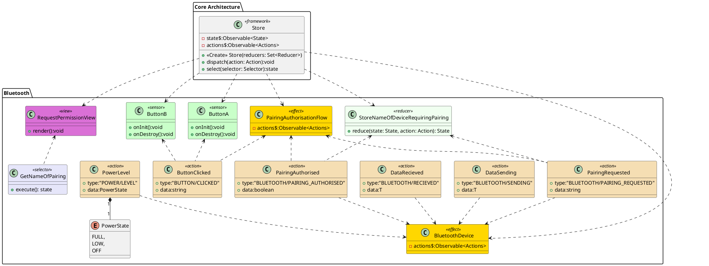

![](http://www.plantuml.com/plantuml/png/hLPVJ_is57ttfx2gIIlZHz1UempHFobKYvekJU5nCiajjPhQp7RQLOZllclIDV1Jt129F8GallUSUuzz3xtLXYbJRWkYmL31jg1VM0OBU66A6QcexnEzuSA-RgbUirpkkNYcArPe-B2I5Knh-aeeNaEMRPwLB4K-aeLKGQ0WBpDGDpVqNWeuZ67V7CSomwN0iCSrCDCSeq5eQQ5IoDO2lpqVcWDt7FOO5gjipVFc45Yj83COT2UBt4LNOCWxOSHs879Gv8sGN_-eBvh3YWjkIzU4L4BqHb817LXkW_cb0j-d2yI17Ws25Ie6UwasY8gINGR1I04pWAys1lf7mJJcW0cIetmNX5vfWt6_-F6J1hLZJmK42sCpSQbIJtzQ75JVSFaovxYp9bltgpYVLciN_avQVIwhJll_DsofgwSBtv82UJirDonAC5AQDJOrB8sHOe1jrLjZUv9YYfhqJ_1IZ44R9G_7JsVXXjyBDofuje7SWbRD7q7DuGNytd2Pfl7iUXHDHt-6uvwLYXdc8peUT8iBejn-XftBFIWhFFGiq6GPHJy8ZU97lCUJINCnLLO4EoWSbSpZnp2vZiA7C3gLKLCvKCSObK36OUVkC5g6QHodzzT9E9eYVDrbUWPr0I972Lf15-5iF9tTjMBE6RUI9l1FYNltXMhdWsc2m7yduL_BS94sRewRPr2QjLHSTo0QBDFxE9akFZ0zILa04mwgq_COTZm39AfDvRLb9hzMFRF1aqBklm6xSfSPsqAygWgsU_5ETsIr9BLRMwcgjxwr0400--S7_Tb2wBa3UWUcelp0KTkgvO1_8IiDz17edDKS3yuSr9PhZSGF752MazLNvLgBhatXirCNN6pGevrJsVkzzzlL5TwTuqvQjjyhFTVGTybj6EtksVK8TqXsp6e71ESK4kBup-5vvroxAMlOdaN8LyVAozlvk-EuHUmEvLQpqsXxNUhh3kckits84QZ5DGWvzwFAysxEEtEdxFRME-0vk-w2uJuktM3giUkUPSUEt8B8ostn7m00)

# Bluetooth

The PairingAuthorisationFlow effect handles the state machine for pairing. It listens to events in sequence (PairingRequested and ButtonClicked) and return a PairingAuthorised action when its finished (note the boolean data field, a request may be rejected).
The 

# PlantUML

