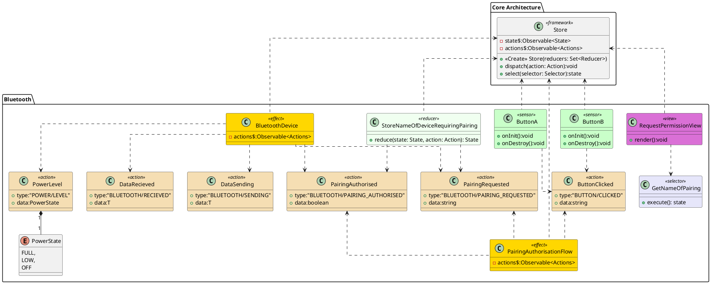

![](http://www.plantuml.com/plantuml/png/hLPVJ_is57ttfx2gIIlZHz5Uempz-YU5Qb7JfIayJYQv9LPJczbEkmhntNTDkb1Gt129F8GallUSUuzz3_sf3LEct1P4Ww62RK4_inIMyCmKCr9HpoDwmuLztTA22p27Pw1IcLoUBEYSPNBFnHDTiqB3oKfQCAtf2w5uZLYwULAo5DbO5bBvleAiJ47TtD0xAU0mWNrp74iDbmB37d9WfZb6Wz3IGYMGvWA_FHsQ0tSSzXWMgJJdMNC8hDUG6WowbKNceYimv8qmP3iG6IZoIiYlVxnVD8Cr5zoMhWcfXEYDfG8wjDm6yqi5daUNY0CzwljhL0psKcqG5IMxzFsn0cO0NsqCz8-2QSm1uyT7-Iu8lT86utxneaSDQiSU2_2NncRYKgMU_h0uhBxXycN6SSjDclUhE8zMQnVUJbfzBgjE-_ytRAchfmlFaW9vhPiR5IKOAKsEJOrAOwGOshRghR4zIJ53JVerl1GJq4R9m_7JMRZHzyAD2vvk8BEWLVD7K7l6lTvebIJH_7eSpiP_1fEUbOePvY4w7dIB2wBSVeHTo3qeAppqBD1q5OO_20sZ1xn7qsbpCLLM23ie79KieeSWlWw3-o2iotYdSg1EC2g6bCFEtM6u2f8eIkwkus0yG_ZtBfCpg4iG6KhG2heCvfFP_BOLSy6ubJI6VqhSkozKknZEOWJ-Emx-MWNBf75pt3p3qkHISTs1QBXAxg9ujZnXUfIo02OSLFNp17Oy1KjKcyfBoqn-hNfcWwU5t7y3TkKkSxQ5Q5qLRFVYZUx8YYIrMrTILMzzQm5W0V3F3_hPGkYv0teBfgAiEKvjrNB0lv2M1le8TCvgZWTd0MhBjKRYUmueIsNrTRdMecjJ-EJK1HSRz6ZdLFP-x_rsTOLtvxYJyzi_o0Othg7lddiwsfspJqUuGx9ZLZiWEAUGaER_70ERwdRjfgnHUnOXNnohGTdEtnt7BM9tABUQdKPxqAc-xf3kEjk7685QN8EGip-g1eFppjmjkxNrJdYEhZjYE8vBHvXwxBfdsR4ZFq5avRRu3m00)

# Bluetooth

The PairingAuthorisationFlow effect handles the state machine for pairing. It listens to events in sequence (PairingRequested and ButtonClicked) and returns a PairingAuthorised action when it is finished (note the boolean data field, a request may be rejected).

# PlantUML

