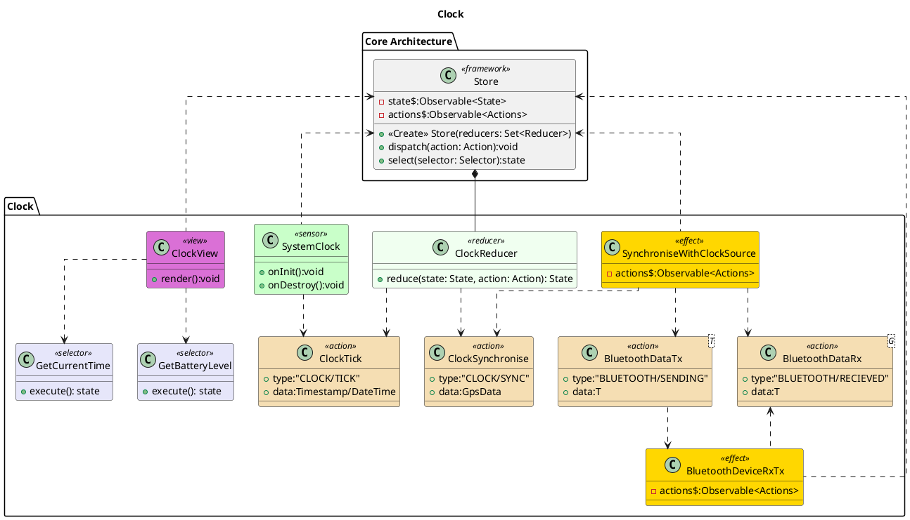

# Clock
On startup the SynchroniseWithClockSource emits a BluetoothDataTx Action to fetch the current time from the users mobile device. This is then stored and the systems clocks tick is used for updating. The SynchroniseWithClockSource can periodically emit a sync event to help compensate for minor clock drift.

One piece of future work that would improve the time acuracy and allow for untethered operation of the clock would be to use the GPS reciever as our time source and pulse per second (PPS) source. The position data (from the `$GPGGA` sentence code) could be used to lookup timezone information, the `$GPZDA` sentence code provides the UTC date and time.

# Bibliography
[1]Glenn Baddeley, ‘GPS - NMEA sentence information’, Jul. 20, 2001. http://aprs.gids.nl/nmea/ (accessed Dec. 11, 2020).
[2]NMEA, ‘National Marine Electronics Association - NMEA’, NMEA 2000® Interface Standard. https://www.nmea.org/content/STANDARDS/NMEA_2000 (accessed Dec. 11, 2020).
[3]E. S. Raymond, ‘NMEA Revealed’, NMEA Revealed, Mar. 2019. https://gpsd.gitlab.io/gpsd/NMEA.html (accessed Dec. 11, 2020).

# PLantUML

