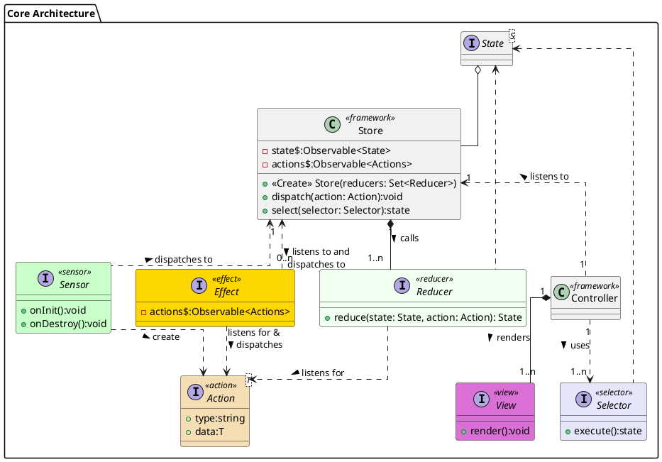

# Core Architecture

The core architecture is based on Event Sourcing (Young, 2010) and Command and Query Responsibility Segregation (CQRS) (Meyer, 1994) and a modified Model-View-Controller (MVC) (Reenskaug, 1979). 

Event sourcing builds the system state from a series of events/actions/commands in a similar manner to an accounting ledger. As with basic accounting, we keep a list of all transactions that have brought the system to its current state. If a mistake happens, and we wish to amend the current state, we need to issue a compensating action (Pacioli, 1494). We cannot modify the state directly.

CQRS was first described by Bertrand Meyer as a command–query separation. He states that every method should either be a command (in our nomenclature an action) which leads to a modification of state but cannot return a value, or it can be a query (in our nomenclature a selector) which can fetch a slice of the current state but must be side effect free. In our architecture, these are taken to their logical conclusion and encapsulated in their own objects.

In the MVC side of our application, the model is replaced with the Store (an Observable (Gamma et al., 1994)) which holds the application state. Usually, we would use the Controller to handle binding events to the view, but in our case, the user is unable to interact with the view directly, and so we use it only for deciding which view to show.

There is a concerted effort in the architecture to limit any inheritance chains and instead focus on composition. Immutability and limiting side effects is also a primary design goal for the system. Data mutation is one of the core sources of design and debugging complexity. Immutable data removes some of this complexity. We also gain the added benefit of being able to efficiently parallelise code without the locking that is usually needed in multithreaded architectures. 

## Overview of core objects
- Actions are simple messages for the system. Anything that happens is modelled as an Action. Actions can be events (something that happened in the past) or commands (an action that we want to be taken). All Actions are plain objects (no methods/functions attached to the class/prototype) and immutable (once created, their internal values cannot be changed).
- Reducers take the current state of the system and an action and returns a new state based on that action. Reducers must be pure and side-effect free. Some literature describes these as projections. We can also wrap reducers to create middleware. Some operations that use this pattern are: logging, snapshotting (taking a snapshot of the current state to allow for faster startup), undo/redo, and developer tooling. Reducers do not mutate the original state, they make a copy and make their changes on that copy. An alternative to this is through the use of persistant data structures and structural sharing [16] to remove the need for defensive copying and the possibilty of developers making mistakes.
- Effects listen to the Observable stream of Actions being dispatched to the Store. They are then free to read the Action contents, transform it to a new Action type, and to make an asynchronous call and dispatch an Action with the results of that call. An example of an asynchronous call is external communication. We listen to a data send Action (a command), and we dispatch a new action based on the response (an event). Many of the patterns found in Enterprise Integration Patterns (EIP) (Hohpe & Woolf, 2003) would be implemented here (discussed below). Effects are used as the primary container for side effects (along with sensors), limiting their impact to the fringes of our application. Effects are responsibe for:
    1. Deciding how to process Actions.
    2. Transforming from one Action type to another.
    3. Performing side effects (calling services or hardware).

- Sensors take readings from the hardware and dispatch Actions (events) with the readings.
- The controller listens to the store for updates and rerenders the views as necessary. It is also responsible for swapping views. This is analogous to a router in web programming. Due to the immutable nature of the Store it can do a simple object comparison to determine if the Store has changed and it should rerender.
- Views query the store for data and contain the logic to render it to the screen.
- Selectors remove the need for the views to understand the shape of the data in the store. It also gives us the ability to have a seperate read and write store (not used in our model but could be added later).
- The Store, while used across our applications it acts only as a container for the state and a message bus. It also handles wiring, but this can be replaced by a dependency injection container if available.

# Effects and Enterprise Integration Patterns
The work of Hohpe and Woolf on EIP can be used to model and discuss the interactions inside Effect classes. We use an observable stream of Actions as the primary form of interaction in Effects. In doing so, we can treat the observable as a message queue and Actions as messages. Their patterns give us a rich visual nomenclature akin to UML. An overview of the core patterns and their relation to the overall flow is discussed below. Messages in EIP would be Actions. Routing and transformations would be internal to an Effect. Endpoints relate either to a side-effect (e.g. calling hardware, external service) or to the Store if our output is another message.

Some common patterns that are used across Effects are:
- Listening for a single Action type. This is modelled as a filter (in EIP nomenclature).
 
- Splitting a single Action into multiple actions (a splitter). One everyday use case for such a pattern is where a sensor outputs multiple types of data. We may want to be able to model our system with more granular Action types. A splitter can take the overall type and break it down to its constituent readings.
 
- combining multiple Actions into a single Action (an aggregator). The use of this pattern can be seen when using the IMU. Very often, a single reading contains little information when used in isolation. A series of reading is instead needed, from which we extract some relationship (e.g. a type of movement detected, or a direction change). In this case, we would use an aggregator. 
 

Even from the limited examples above, being able to model our domain using the EIP patterns brings a level of clarity to Effects that UML alone cannot provide. In our architecture, the two in combination, allow for a macro and micro view of the system. We focus mainly on the macro view in this document and leave the micro view to the individual developers.

# Bibliography

- [1]G. E. Krasner and S. T. Pope, ‘A cookbook for using the model-view controller user interface paradigm in Smalltalk-80’, J. Object Oriented Program., vol. 1, no. 3, pp. 26–49, Aug. 1988.
- [2]G. Krasner and S. Pope, ‘A Description of the Model-View-Controller User Interface Paradigm in the Smalltalk-80 System’, Sep. 21, 2010. https://web.archive.org/web/20100921030808/http://www.itu.dk/courses/VOP/E2005/VOP2005E/8_mvc_krasner_and_pope.pdf (accessed Dec. 05, 2020).
- [3]T. Reenskaug, ‘A note on DynaBook requirements’, 1979.
- [4]M. Fowler, ‘CommandQuerySeparation’, martinfowler.com. https://martinfowler.com/bliki/CommandQuerySeparation.html (accessed Dec. 05, 2020).
- [5]G. Young, ‘CQRS Documents by Greg Young’, p. 56.
- [6]E. Gamma, R. Helm, R. Johnson, J. Vlissides, and G. Booch, Design Patterns: Elements of Reusable Object-Oriented Software, 1st edition. Reading, Mass: Addison-Wesley Professional, 1994.
- [7]M. Fowler, ‘Domain Event’, martinfowler.com, Dec. 12, 2005. https://martinfowler.com/eaaDev/DomainEvent.html (accessed Dec. 05, 2020).
- [8]E. Evans, R. Venables, and J. Fuller, Domain-Driven Design: Tackling Complexity in the Heart of Software, 1st edition. Boston: Addison-Wesley, 2003.
- [9]G. Hohpe and B. Woolf, Enterprise Integration Patterns: Designing, Building, and Deploying Messaging Solutions, 1st edition. Boston: Addison-Wesley Professional, 2003.
- [10]M. Fowler, ‘Event Sourcing’, martinfowler.com, Dec. 12, 2005. https://martinfowler.com/eaaDev/EventSourcing.html (accessed Dec. 05, 2020).
- [11]T. Reenskaug, ‘MVC: XEROX PARC 1978-79’. http://heim.ifi.uio.no/~trygver/themes/mvc/mvc-index.html (accessed Dec. 05, 2020).
- [12]B. Meyer, Object-Oriented Software Construction. New York: Prentice Hall, 1994.
- [13]B. Meyer, Object-Oriented Software Construction, 2nd edition. Upper Saddle River, N.J: Pearson College Div, 2000.
- [14]J. Nicola, M. Mayfield, and M. Abney, Streamlined Object Modeling: Patterns, Rules and Implementation, PAP/CDR edition. Upper Saddle River, NJ: Prentice Hall, 2001.
- [15]L. Pacioli and  donor D. Burndy Library, Su[m]ma de arithmetica geometria proportioni [et] proportionalita. [Venice : Paganinus de Paganinis], 1494.
- [16]J. R. Driscoll, N. Sarnak, D. D. Sleator, and R. E. Tarjan, Making Data Structures Persistent, vol. 38. Academic Press, 1989.

# PlantUML

