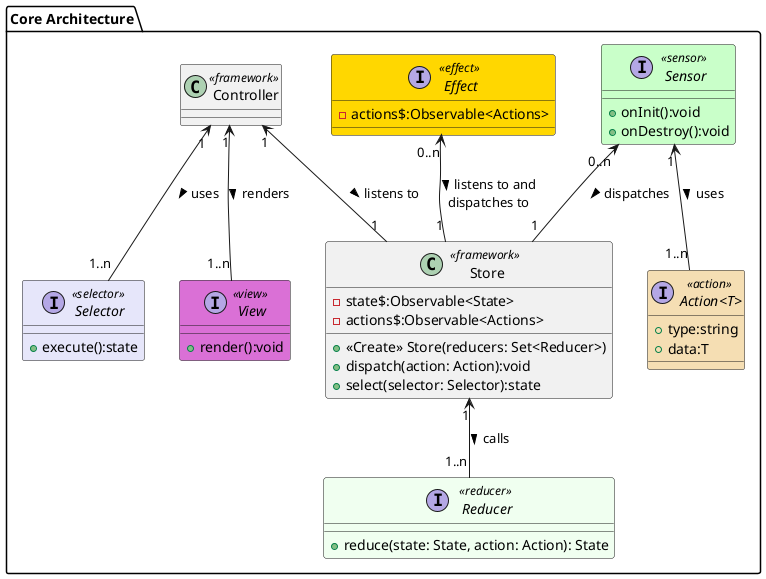

# Core Architecture

The core architecture is based on Event Sourcing (Young, 2010) and Command and Query Responsibility Segregation (CQRS) (Meyer, 1994) and a modified Model-View-Controller (MVC) (Reenskaug, 1979). 

Event sourcing builds the system state from a series of events/actions/commands in a similar manner to an accounting ledger. As with basic accounting we keep a list of all transactions that have brought the system to its current state. If a mistake is made and we wish to ammend the current state we need to issue a compensating action (Pacioli, 1494). We cannot modify the state directly.

CQRS was first described by Bertrand Meyer as command–query separation. He states that every method should either be a command (in our nomenclature an action) which leads to a modification of state but cannot return a value, or it can be a query (in our nomenclature an selector) which can fetch a slice of the current state but must be side effect free. In our arcitecutre these are taken to their logical conclusion and encapsulated in their own objects.

In MVC side of our application the model is replaced with the Store (an Observable (Gamma et al., 1994)) which holds the application state. Normally we would use the controller to handle binding events to the view but in our case the user is unable to intereact with the view directly and so we use it only for deciding which view to show. 

## Overview of core objects
- Actions are simple messages for the system. Anything that happens is modelled as an action. These can be events (something that happened in the past) or a command (an action that we want taken).
- Reducers take the current state of the system and an action and returns a new state based on that action. Reducers must be pure and side-effect free. Some litrature describes these as projections. We can also wrap reducers to create middleware. Some operations that user this pattern are: logging, snapshotting (taking a snapshot of the current state to allow for faster startup), undo/redo, and devolper tooling.
- Effects listen for actions dispatched to the store and can create actions. This can be used to handle async tasks. An example of this is external communication. We listen to a data send action and we dispatch a new action based on the response. Many of the patterns found in Enterprise Integration Patterns (Hohpe & Woolf, 2003) would be implimented here (action deciders, action transformers and asynchronous actions).
- The controller listens to the store for updates and rerenders the views as necessary. It is also responsible for swapping views. This is analogous to a router in web programming.
- Views query the store for data and contain the logic to render it to the screen.
- Sensors take readings from the hardware and dispatch actions.

# Bibliography

- [1]G. E. Krasner and S. T. Pope, ‘A cookbook for using the model-view controller user interface paradigm in Smalltalk-80’, J. Object Oriented Program., vol. 1, no. 3, pp. 26–49, Aug. 1988.
- [2]G. Krasner and S. Pope, ‘A Description of the Model-View-Controller User Interface Paradigm in the Smalltalk-80 System’, Sep. 21, 2010. https://web.archive.org/web/20100921030808/http://www.itu.dk/courses/VOP/E2005/VOP2005E/8_mvc_krasner_and_pope.pdf (accessed Dec. 05, 2020).
- [3]T. Reenskaug, ‘A note on DynaBook requirements’, 1979.
- [4]M. Fowler, ‘CommandQuerySeparation’, martinfowler.com. https://martinfowler.com/bliki/CommandQuerySeparation.html (accessed Dec. 05, 2020).
- [5]G. Young, ‘CQRS Documents by Greg Young’, p. 56.
- [6]E. Gamma, R. Helm, R. Johnson, J. Vlissides, and G. Booch, Design Patterns: Elements of Reusable Object-Oriented Software, 1st edition. Reading, Mass: Addison-Wesley Professional, 1994.
- [7]M. Fowler, ‘Domain Event’, martinfowler.com, Dec. 12, 2005. https://martinfowler.com/eaaDev/DomainEvent.html (accessed Dec. 05, 2020).
- [8]E. Evans, R. Venables, and J. Fuller, Domain-Driven Design: Tackling Complexity in the Heart of Software, 1st edition. Boston: Addison-Wesley, 2003.
- [9]G. Hohpe and B. Woolf, Enterprise Integration Patterns: Designing, Building, and Deploying Messaging Solutions, 1st edition. Boston: Addison-Wesley Professional, 2003.
- [10]M. Fowler, ‘Event Sourcing’, martinfowler.com, Dec. 12, 2005. https://martinfowler.com/eaaDev/EventSourcing.html (accessed Dec. 05, 2020).
- [11]T. Reenskaug, ‘MVC: XEROX PARC 1978-79’. http://heim.ifi.uio.no/~trygver/themes/mvc/mvc-index.html (accessed Dec. 05, 2020).
- [12]B. Meyer, Object-Oriented Software Construction. New York: Prentice Hall, 1994.
- [13]B. Meyer, Object-Oriented Software Construction, 2nd edition. Upper Saddle River, N.J: Pearson College Div, 2000.
- [14]J. Nicola, M. Mayfield, and M. Abney, Streamlined Object Modeling: Patterns, Rules and Implementation, PAP/CDR edition. Upper Saddle River, NJ: Prentice Hall, 2001.
- [15]L. Pacioli and  donor D. Burndy Library, Su[m]ma de arithmetica geometria proportioni [et] proportionalita. [Venice : Paganinus de Paganinis], 1494.

# PlantUML


```
