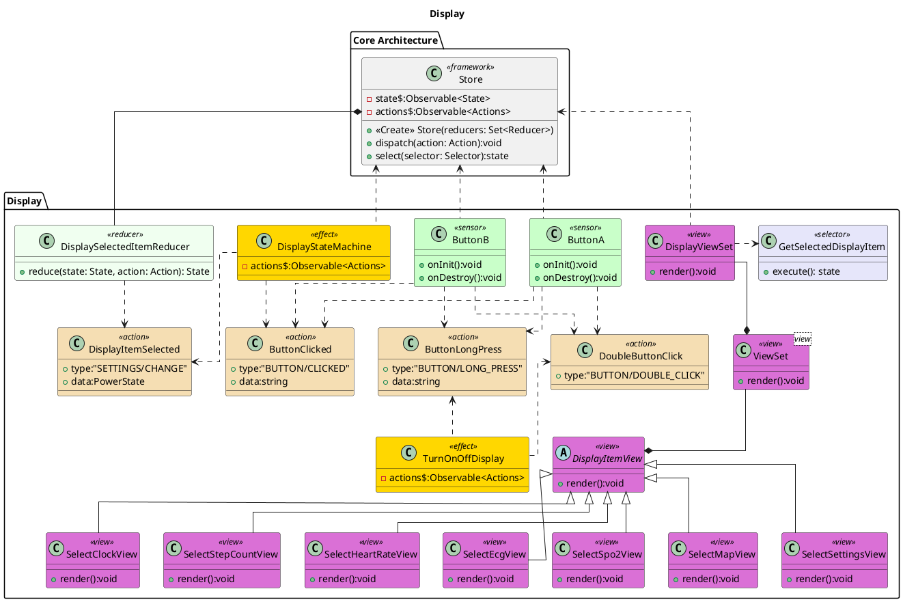

![](http://www.plantuml.com/plantuml/png/jLNHRk8w47ttLrZHbIvjBrIwZr6sAWH4qLAe6hhxMBd90171HlO45dNxx-iaxk8c8QABDa_WEJxZEJuplbN89ARhXAXLp3TCiZLLInQ9NSmNTCuI1LOaYJdWVWDKI5mAAn0cJ2dwIgZ-UYnSBQH8UUIBH4ZFan2b8SYR6tedEEpxiAl7iH1ZmJNi-n8OrcCKS2KogXc4IwxN5ljwu3Q6dOPDPRYCete8pESGeWODHH8TIvTeI9vmpBR08v3aZH2CCG7QZzKcONj2_lro-6W4yvZ7MIMAR3GVMm1rV261ThEpeEPB9JY5M4Ou9q2HhNdUNAi9Eo5NEgD6cE_Aytm9346lvj2MqLIvD03q7et25xztj1Lg-3_kz4M1tBAN1Bm0Cu83ef1RVS1qYxK3wYhIHJ8Cbwq2xj82Sk5kHHmTO8LGhNUzzB7ChmitFqcEVDFQ7JGnydrKefSY2jwbrarRCWW-qjAsoia5xuD2AVPsv8rKQ7j_XzPFud054RKSR95d_U8wlQVPR3gvziSZ_-kWxrZwCcHQ8gdRxHZ_MF35WmIbJiamdaw6pm-FWo0uDKbVfFhghL9EITEVFlN6W-Uy7gVAQUvsXB0kZ03DyWI3sMmq6GRN_brtCXoKZ_uWTY1p_nvDbKVlcUum3jJgxTSJ3L_XdQMIJ_bqFZS9pYUr3ciqoVGnlKljEMdfKoosyYPoQLxbVxJSY_I8DaF0zrJMZL1xhbcfu0U4AK9Bywb6hR_5i0i0gPcofVDcG_9envYjnSRF4R0NXL9NNhLOHledXocqyHCHhiwZ210slaWvdaTp1qpY8qCuZsOGBiuiPoF-Fu_XdctEF08WwccbFiL2zKSqsViZqkdSV1pH9jAhHYgRxBbhRQl6x8qrizJUMnSc3ID1RwcTf2vr749ApTYH6btVy1LiEsfVKlE7s8lbhYAaqcO_s-roupI0hDPe1jhcRmPgUpT2Z86RCSQYpH3RX8JKFJHL7zMYwk-H459vP3ffdKtgSLKhaW251EfrEhNFeWbVwWAFkwx4ORd6YXZFLvTwv1PubAwJNm00)

# Display (Main Menu)
The Display view is the main menu for selecting the app you wish to use. It is also responsible for turning on and off the screen.

# Bibliography

# PlantUML

