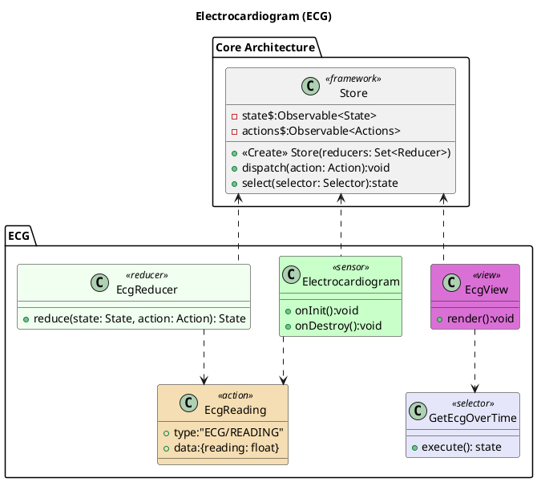

# Electrocardiogram (ECG)

The Electrocardiogram class encapsulates the functionality for the sensor. Once it has collected the readings it dispatches an EcgReading event to the Store. These readings then pass through the EcgReducer to build the state. The EcgView queries the Store for the State data and renders the data each time the store updates.

# PlantUML

