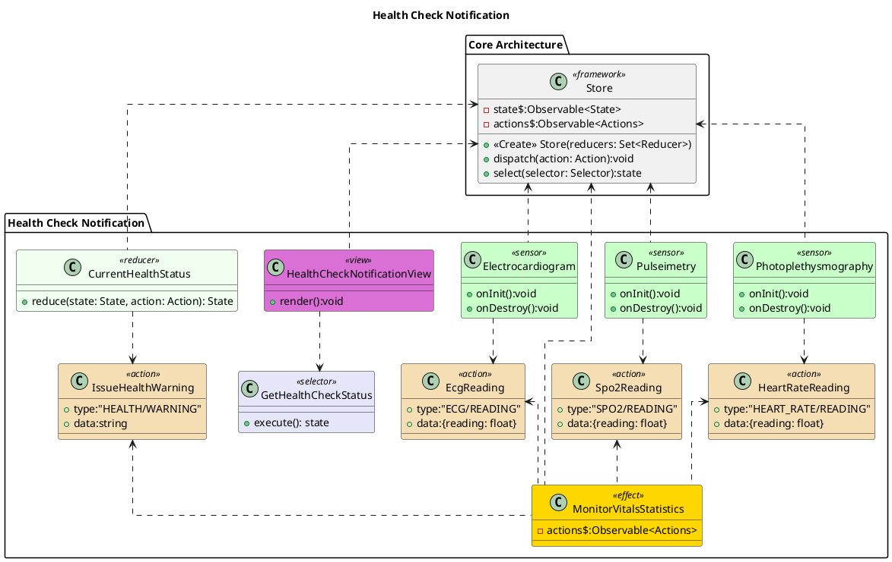

# Health Check Notification

Much of the health check data can be shared from the SpO2 section.

# PlantUML

```plantuml
@startuml
title Health Check Notification

skinparam shadowing false
skinparam linetype ortho
skinparam class {
    BackgroundColor<<reducer>> HoneyDew
    BackgroundColor<<action>> Wheat
    BackgroundColor<<sensor>> Technology
    BackgroundColor<<view>> Orchid
    BackgroundColor<<effect>> Gold
    BackgroundColor<<selector>> Lavender
}

'=========== definitions
package "Core Architecture" {
    class "Store" <<framework>> {
        +<<Create>> Store(reducers: Set<Reducer>)
        -state$:Observable<State>
        -actions$:Observable<Actions>
        +dispatch(action: Action):void
        +select(selector: Selector):state
    }
}

package "Health Check Notification" {

    class Photoplethysmography <<sensor>> {
        +onInit():void
        +onDestroy():void
    }

    class Pulseimetry <<sensor>> {
        +onInit():void
        +onDestroy():void
    }

    class Electrocardiogram <<sensor>> {
        +onInit():void
        +onDestroy():void
    }

    class HeartRateReading <<action>> {
        +type:"HEART_RATE/READING"
        +data:{reading: float}
    }

    class Spo2Reading <<action>> {
        +type:"SPO2/READING"
        +data:{reading: float}
    }

    class EcgReading <<action>> {
        +type:"ECG/READING"
        +data:{reading: float}
    }

    class IssueHealthWarning <<action>> {
        +type:"HEALTH/WARNING"
        +data:string
    }

    class MonitorVitalsStatistics <<effect>> {
        -actions$:Observable<Actions>
    }

    class HealthCheckNotificationView <<view>> {
        +render():void
    }

    class CurrentHealthStatus <<reducer>> {
        +reduce(state: State, action: Action): State
    }

    class GetHealthCheckStatus <<selector>>{
        +execute(): state
    }
}

'=========== links

Photoplethysmography ..> HeartRateReading
Pulseimetry ..> Spo2Reading
Electrocardiogram ..> EcgReading

MonitorVitalsStatistics .u.> HeartRateReading
MonitorVitalsStatistics .u.> Spo2Reading
MonitorVitalsStatistics .u.> EcgReading
MonitorVitalsStatistics .u.> IssueHealthWarning

CurrentHealthStatus ..> IssueHealthWarning

MonitorVitalsStatistics .u.> Store
Photoplethysmography .u.> Store
Pulseimetry .u.> Store
Electrocardiogram .u.> Store

CurrentHealthStatus .u.> Store

HealthCheckNotificationView ..> GetHealthCheckStatus
HealthCheckNotificationView .u.> Store
@enduml
```
