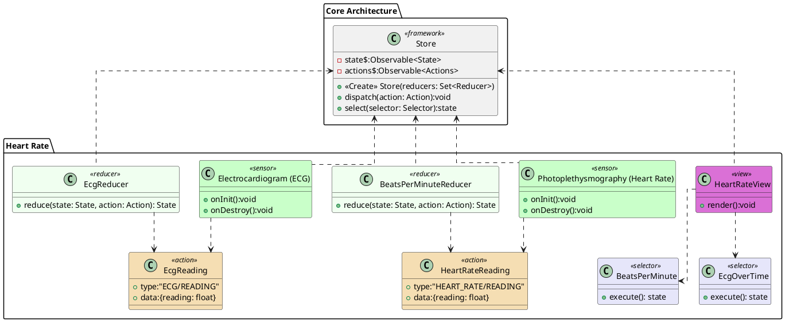

# Heart Rate and Electrocardiogram (ECG)

The Electrocardiogram/Photoplethysmography class encapsulates the functionality for the sensor. Once it has collected it is readings it dispatches an EcgReading/HeartRateReading event to the Store. These readings then pass through the BeatsPerMinuteReducer/EcgReducer to build the state. The HeartRateView queries the Store for the State data and renders the data each time the store updates.

# PlantUML

