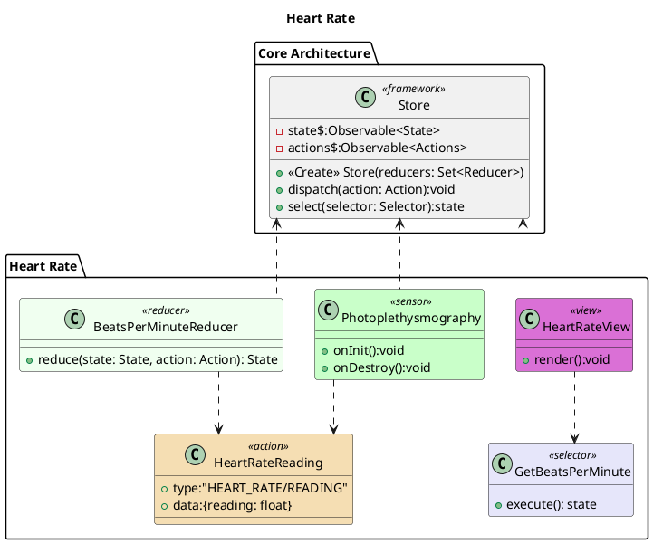

# Heart Rate

The Photoplethysmography class encapsulates the functionality for the sensor. Once it has collected it is readings it dispatches an HeartRateReading event to the Store. These readings then pass through the BeatsPerMinuteReducer to build the state. The HeartRateView queries the Store for the State data and renders the data each time the store updates.

# PlantUML

