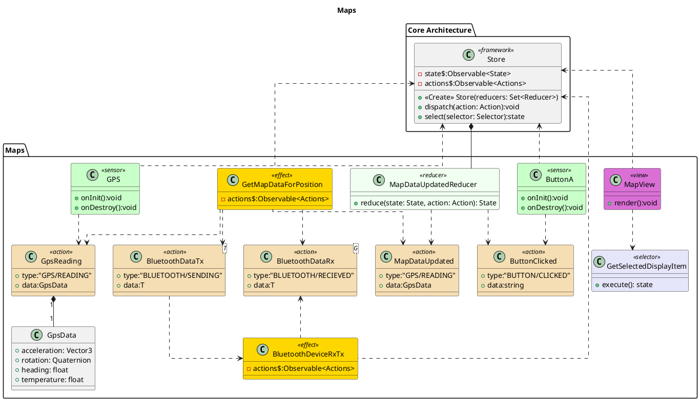

![](http://www.plantuml.com/plantuml/png/hLPTR-eu47tthx3GIakt2zLgtw8iAWMMeksMBgJTXwlxuCO3YN3jo7RuKDN_VYSVN4pmfPLkewfAPuvdZe_79xqsbccRlmX2p2gL6TFiXPg4SRL9vP8kc33WP4GgmUuoe4hRH3c9M31Zw2kX-DomUBNKAfTye8JIOQY1vp7eNe_UAWcx8MpyE1RRL4c4_Py0itwC0MbKKIg2E94OM-xym7KA6uHDTPoat0-1nG9YYw2n4ln7xGH2oePtR0sIWoPlXDZK2g3_iimGykjVXuToMAGoBRPXI8R5s19eQw0qq7v1n6AnN4EhLgfIhJMtgeY5uGAbX8tIAso7YFgv3CE11cO1eoMqNGjg0Ze76yvgUI--h-WOY_1VWkcp0RrcpmB2kIqA712LrkO8qwzY1zGbJqt6R9oqAtX0AyX5i5OfFy0gbTfxiP1M_NOHb4nAv1iALsjIINSamarkhP9zwfomeu2I4rIrtUohv12CrMhdPjwSgkE7-QTKT8cA7AnIDXd2EerXjessr1cbrmzBtAWx1ekY39bbVolze4mvH3zH-KJRWKZZ5N3gt3D7Z-9M1wsRnoYQtbyDxYQ3VqR3bZC8o2j0OT0KFDGpK_1sox4u1W6QLLFpL0x3duUqLhPE_PSp2rhY-o6R0EFOAA0BePXrEC9BLjJCDRYv9fTPjVpiHd4mhcQZ_d1oFsxkijxDQUdwU1upX07_xFBEO65wjWt7lVD7TVSuYgRJw1OR3IQZfzFZYjxf4Mt3wACzvgDxtsQYzrIglOcw7m6dJHLiboOHqDAZVgTDhwdYtXjJ-Gpm8VgKOBi9JWXrJTjf1Lk8Smjjh5Usyp9_Ic53gsz7asXX_GrJm9-zRNMxlUDhHeXV22-mwbka_7iYXFZj0PSu4ty6r3XuGXe1skM8ydWR8QT1H8jcpTdseztF8ez5ysle0nBYLuvslYGfvo2_Yiu9ZSRVVcmjM7tG1upkx0U64CTqMd-qVkjqyFVU5GbwGVESIFaPfs6twxTz9-zHlyvY6_zbSrRN39r8lGydWlp8DKXU_1Fu3G00)

# Maps

The GetMapDataForPosition for the listens for changes in the map configuration (zoom level) for messages from the gps. It then converts them into a request to fetch map data over bluetooth. One a reply is recieved it then sends out a MapDataUpdated action. Once the reducer saves the updated map data in the store the view rerenders with the updated map. 

# Bibliography

# PlantUML

