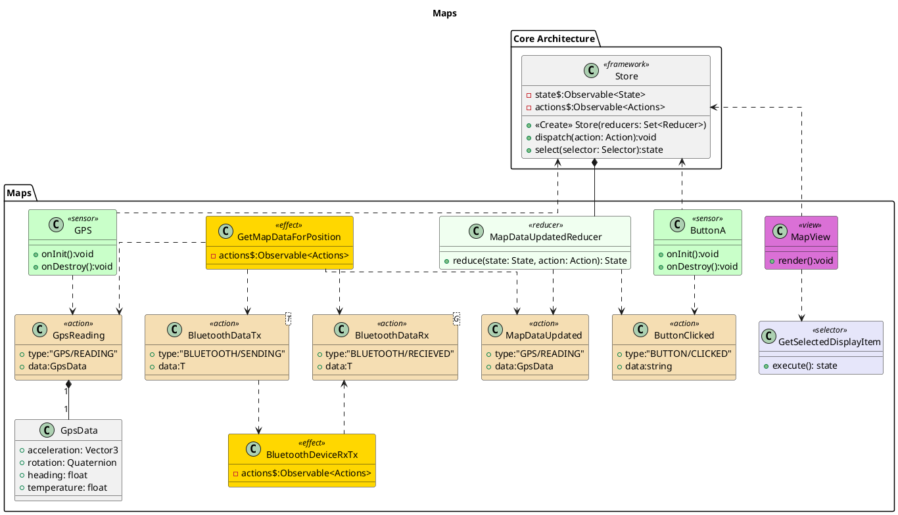

![](http://www.plantuml.com/plantuml/png/hLPVRze-57ttfx3GJ_hHRL1DUuioL0gCedMbWxHxcFRWnXSIuTgHxV17LR_xRlumtDGhbLQhgg9xJ-wvFhu-uSnOfcr-BmWngrHcJBDxQXB6rIQLIxfWme2J4Qa4kyk0AcqJvIHYmOoX3uJYEcVnQgbLBlb02QN3K0FFOz2z7hrG4dP3sFXnBBQfaWZxaG2pVem1QLHHAe8uaHXRxlp0TGeRX4rrdAJS3u750cABeB4I_6zq0Y4buILRW-IWoICXDhK2w3UM6KB-_tnObCCYbMcn3KCoBCQMG5i3fO7sYqOi5iirj6gbAjLQSwkAM1WkK4hOABr2EaJKwtqO3ZGm2nWjeUrQK1FGETXmLijxykUDZh48_o-OtXdGQtOd89mNaTu1KMbjdc3wLQntOEQfoPYDatO53sW5EGdMAkK7MALIUoyMjbK_dGHb9oNo4OMhDQcaUoB2UMwjadtgdB2ZW98JLBNTv5Lo2CPgjNCpZqxLyVNyJIgwZOeSh58s6S8wZM6sZRRK6QM7rqhSh3i6Yw8CcMLVbBvMfXoYVwZyJDk1IECLSEhSCqUFubO7hVERA9fUdGuk9uEles7B6GJiAq1Xq1GyhMUcwDijn-8O16XMJSrjEGoV3ccjR9twdZCBMkBp8Pi0uqWKq8LGp3ezmdrMrCmrkBbcBxFgzHStYeDnEXlrXvEhSNENzMwUbwwFvoP36F2tBkyC5gPdst3SU_ceBcz6qNGQNI3HO3AwVNvSqH6EQ1j6h-MOZwvycucEgLHx4tK-0YvD5MoN9X7GqgC-qARNL77lZQby1lWGVKgmtGGdXBgcxL315kBSGXlhbNJUpczJsD3gsz5ijB3-XYdWtzwskjtUqsj6Y5S8Fx3YBLB-FP5Y-Gq2Nt9c_WLGu-W9QGHeboFAusw4U8AqAn3T6DdZxCUHZVdng-W3aWO5xVnCKiv1_XATvkRtntR0wCx--0bnBAJriVMkqy7_UuyZUBERcXDIVfKf8ltJN-V3RdTFuaJgLfm8Kf0paBpuLVOR)

# Maps

The GetMapDataForPosition for the listens for changes in the map configuration (zoom level) for messages from the gps. It then converts them into a request to fetch map data over bluetooth. One a reply is recieved it then sends out a MapDataUpdated action. Once the reducer saves the updated map data in the store the view rerenders with the updated map. 

# Bibliography

# PlantUML

