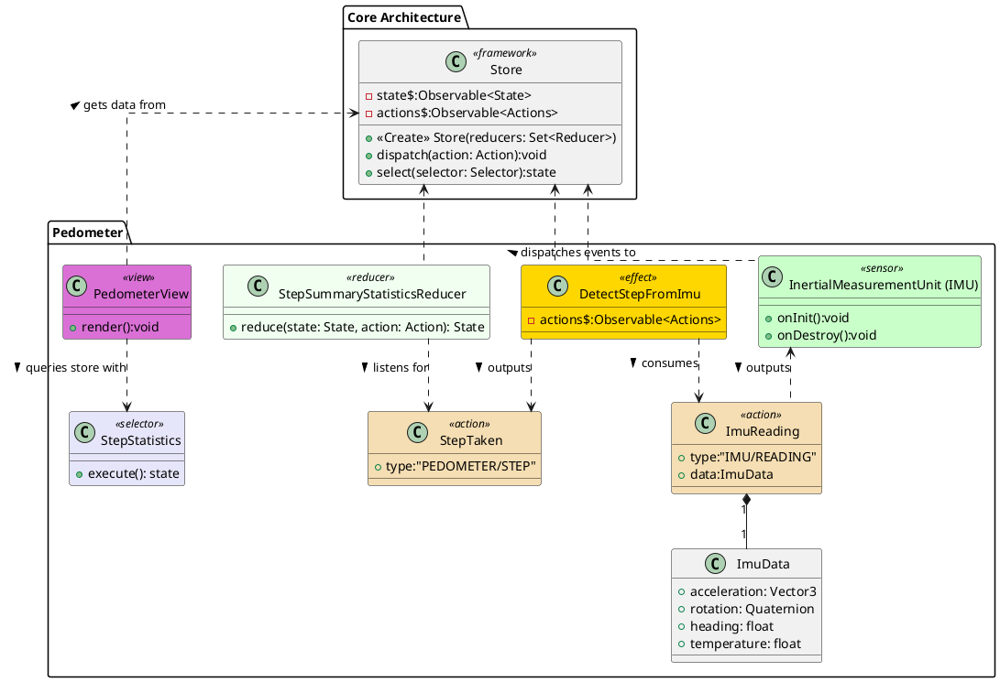

# Pedometer
The Pedometer measures the number of steps taken by using data from the IMU. As it requires a window of data to operate on and not a single reading, we feed it into an effect class. This effect class can be used to do a simple detection of a step by finding the local maxima of the acceleration magnitude data. Only peaks with a minimum height above one standard deviation are treated as a step. [1] It may also be used with an AI algorithm for more accurate detection of steps or to detect push (and push type) if the user is in a wheelchair. [2] Based on the number of steps, we can do a simple calculation for the number of calories burned [3][4] as part of future work.

# Bibliography

- [1]‘Counting Steps by Capturing Acceleration Data from Your Mobile Device - MATLAB & Simulink’. https://www.mathworks.com/help/matlabmobile_android/ug/counting-steps-by-capturing-acceleration-data.html (accessed Dec. 04, 2020).
- [2]‘The inside story of how Apple cracked its wheelchair mode in watchOS 3’, The Indian Express, Jun. 04, 2020. https://indianexpress.com/article/technology/gadgets/apple-watchos-3-wheelchair-mode-features/ (accessed Dec. 05, 2020).
- [3]B. E. Ainsworth et al., ‘Compendium of Physical Activities: an update of activity codes and MET intensities’:, Medicine & Science in Sports & Exercise, vol. 32, no. Supplement, pp. S498–S516, Sep. 2000, doi: 10.1097/00005768-200009001-00009.
- [4]‘Walking Calorie and Distance Calculator by Pedometer Steps’. http://knightsofknee.com/calculators/walking-calories-pedometer-steps.html (accessed Dec. 05, 2020).

