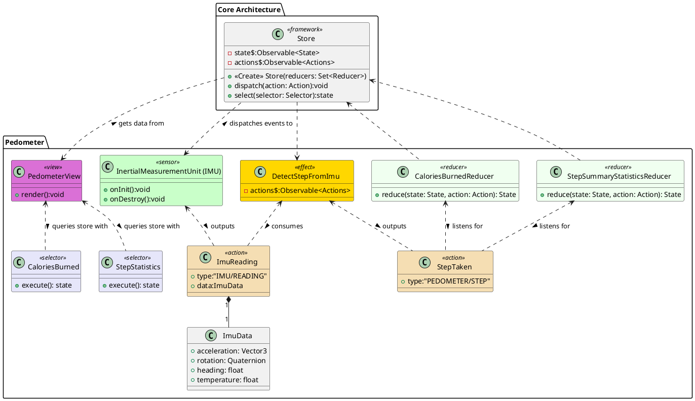

![](http://www.plantuml.com/plantuml/png/jLHHRyCq47xthpX5IBJ0EY7Ueb1jQykenDXek_7i9PVMQc87-z9IJVntpaaM1jJjYaGUskJytVVTPv_lnf6qL9U585C16NWrHAQ4J5bCIHajX4C2BKjqbKnnYPMqaeo5E1PkgxJ_BC5jP6RsIgyXbuN33ojf8Ps3Dm7ytCbqkxQcrjd45COcYSMiJj6En_2ZqNYOuluuJZQbCEpN3KewZd6edV5KAqmtccFhmt7WJk6UOOystQZiE0JpdDqpwDuKMKYkO4WZ-9FSeSxGYZ-4-FBxlnx8C5TQ-TAT4Er6H1DZ4MwzDd5-RJ6EOSay646Iv5QMk3TsowoyPLydoSIY9EJF1ZFeDinn3bAowBPlAE3A4UE-Y1zV7TgTV2qmMPBFvALszzpV5c_Rs9X5CkKgIUbcqE9YQDU6ySweZDTRfuDtmopTlGtZHjJRximzOMPA9BHiQgxHafB50qh7DalKzAmLmM3-y3oCe3-mrgdHSruSzA96Jz6HDOSk518fwwaa6JKSCasnG2jR5ozDZTznt1hgOh_KalCqltDuWpBZZeqXBuma3X2MbK_dQhjWM7NH9aVGDsVhWmuLnX5Rl5xCRgVpd-yZlyDSOjoL6g1S4bOhkKKTO7oQJHyVPglPudgvcZr50POf-gRoN3zOKxAYP-kR-UrCBmH8-_SNXVi8-WlaYxDDumVFgBUshCjIseDlIUL8fQvhtGZw8T0p-gz1qra-b_--WNzsPXiFw4raOQn2TrTRZTd_9zGQwnr5y74eU0Ny7TEQSC0qxjFrdgVvrvWfbDuwSVBCHgFJfSSmXjzgz6M0OsM4lQBDUSwmZ__8MOzEZaZFkKPouAyKvDQKGbmqTKRd-T_d8Jh07MeM8tEfI71UU05JKrMJ4o84WkZRwAkhA_uzFkt4sKiVhg3rc1hjwXBTPvY2WohivVILFyTPC1wrWznOSVfcNym7Gfmw_b4s6f-Rg2S94cQuOFfTnXNmBsvGPtLP_0a0)

# Pedometer
The Pedometer measures the number of steps taken by using data from the IMU. As it requires a window of data to operate on and not a single reading we feed it into an effect class. This effect class can be used to do a simple detection of a step by finding the local maxima of the acceleration magnitude data. Only peaks with a minimum height above one standard deviation are treated as a step. [1] It may also be used with an AI algorithm for more accurate detection of steps or to detect push (and push type) if the user is in a wheelchair. [2] Based on the number of steps we can do a simple calculation for the number of calories burned (CaloriesBurnedReducer)[3][4].

# Bibliography

- [1]‘Counting Steps by Capturing Acceleration Data from Your Mobile Device - MATLAB & Simulink’. https://www.mathworks.com/help/matlabmobile_android/ug/counting-steps-by-capturing-acceleration-data.html (accessed Dec. 04, 2020).
- [2]‘The inside story of how Apple cracked its wheelchair mode in watchOS 3’, The Indian Express, Jun. 04, 2020. https://indianexpress.com/article/technology/gadgets/apple-watchos-3-wheelchair-mode-features/ (accessed Dec. 05, 2020).
- [3]B. E. Ainsworth et al., ‘Compendium of Physical Activities: an update of activity codes and MET intensities’:, Medicine & Science in Sports & Exercise, vol. 32, no. Supplement, pp. S498–S516, Sep. 2000, doi: 10.1097/00005768-200009001-00009.
- [4]‘Walking Calorie and Distance Calculator by Pedometer Steps’. http://knightsofknee.com/calculators/walking-calories-pedometer-steps.html (accessed Dec. 05, 2020).

