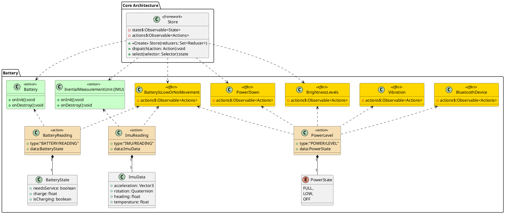

# Power Levels and Battery
Any device that has a low power state listens for the PowerLevel action and adjusts their behaviour accordingly.

# PlantUML

```plantuml
@startuml
set namespaceSeparator ::
skinparam shadowing false
skinparam class {
    BackgroundColor<<reducer>> HoneyDew
    BackgroundColor<<action>> Wheat
    BackgroundColor<<sensor>> Technology
    BackgroundColor<<view>> Orchid
    BackgroundColor<<effect>> Gold
    BackgroundColor<<selector>> Lavender
}

'=========== definitions

class "Core Architecture:: Store" <<framework>> {
 +<<Create>> Store(reducers: Set<Reducer>)
 -state$:Observable<State>
 -actions$:Observable<Actions>
 +dispatch(action: Action):void
 +select(selector: Selector):state
}

class "Battery:: Battery" <<sensor>> {
 +onInit():void
 +onDestroy():void
}

class "Battery:: InertialMeasurementUnit (IMU)" <<sensor>> {
 +onInit():void
 +onDestroy():void
}

class "Battery:: BatteryState" {
 +needsService: boolean
 +charge: float
 +isCharging: boolean
}

class "Battery:: BatteryReading" <<action>> {
 +type:"BATTERY/READING"
 +data:BatteryState
}

class "Battery:: ImuData" {
 +acceleration: Vector3
 +rotation: Quaternion
 +heading: float
 +temperature: float
}

class "Battery:: ImuReading" <<action>> {
 +type:"IMU/READING"
 +data:ImuData
}

enum "Battery:: PowerState" {
 FULL,
 LOW,
 OFF
}

class "Battery:: PowerLevel" <<action>> {
 +type:"POWER/LEVEL"
 +data:PowerState
}

class "Battery:: BatteryIsLowOrNoMovement" <<effect>> {
 -actions$:Observable<Actions>
}

class "Battery:: PowerDown" <<effect>> {
 -actions$:Observable<Actions>
}

class "Battery:: BrightnessLevels" <<effect>> {
 -actions$:Observable<Actions>
}

class "Battery:: BluetoothDevice" <<effect>> {
 -actions$:Observable<Actions>
}

class "Battery:: Vibration" <<effect>> {
 -actions$:Observable<Actions>
}


'=========== links

"Battery:: ImuReading" "1"*--"1" "Battery:: ImuData"
"Battery:: InertialMeasurementUnit (IMU)" <.. "Battery:: ImuReading"
"Battery:: BatteryIsLowOrNoMovement" <.. "Battery:: ImuReading"

"Battery:: BatteryReading" "1"*--"1" "Battery:: BatteryState"
"Battery:: Battery" <.. "Battery:: BatteryReading"
"Battery:: BatteryIsLowOrNoMovement" <.. "Battery:: BatteryReading"


"Battery:: PowerLevel" "1"*--"1" "Battery:: PowerState"
"Battery:: BatteryIsLowOrNoMovement" <.. "Battery:: PowerLevel"
"Battery:: PowerDown" <.. "Battery:: PowerLevel"
"Battery:: BrightnessLevels" <.. "Battery:: PowerLevel"
"Battery:: BluetoothDevice" <.. "Battery:: PowerLevel"
"Battery:: Vibration" <.. "Battery:: PowerLevel"


"Core Architecture:: Store" ..> "Battery:: Battery"
"Core Architecture:: Store" ..> "Battery:: InertialMeasurementUnit (IMU)"
"Core Architecture:: Store" ..> "Battery:: BatteryIsLowOrNoMovement"
"Core Architecture:: Store" ..> "Battery:: PowerDown"
"Core Architecture:: Store" ..> "Battery:: BrightnessLevels"

@enduml
```
