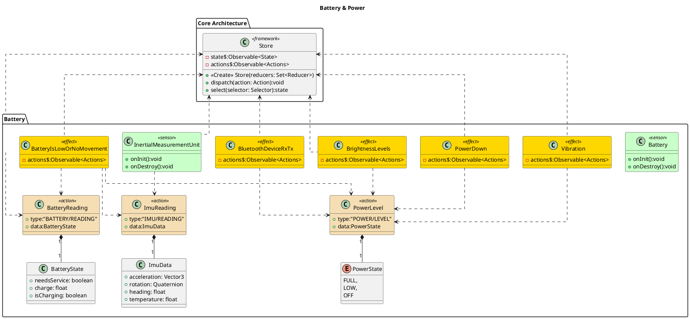

![](http://www.plantuml.com/plantuml/png/hLLTRzem57tthx3GjD5rfPhs5cLL-Q0TKbeweAtsQ98BiJ0siXrILF7VvtnGUmcfjeay8BZd-DnxpxqErqeJgPCrGqXJpG3tYDOWT_WZVX0fI8JKYl8DaMID6UMWTnl0GkfOE82AIIHIofTuGPW21maPKGg_8coU7WbNIoaI7lK54zBt9KH92FBg2lyG77O3I8_pIAYfu8Rs70FHnpaAk1APr0p2c9lOSdUSkAMG6jfOXZ6DZbDWiO1G6zAjO55JEcOeUSA0R8578D4UeK_VxOCZM51Eiz8LsXW1iWJSwWi9k9ibrqOWaT0gt2cTckeCz_s5CGzI8LScWS7Bvzpt-nA81XFDcUtIGkNXAMX_KXfwzdRYGcb3_-2DvmhabimP-5ET2LX6uQxwWzCjOfPr7b6r8JgCsmNTmmNbpDiA6bbQuKlxO8yfg_nsvkMLvCmzsfU6s7LxHOuBXw0Tgsk2u2DZQxkQMl01A2t5paNshko8WzIKi3iWoZY_1guVZT99qzZgSvzTGGuGgQcnc8RWuRaG30YtS1WJkJJ0WWcYRPYgVWQOo-MUEPvo0YGoH6olZ9i_kxfUgzUTpOQJNvUJONSmkhzjEICccdXkyKSSN2S3mt9LIHW20qcAhNZAX_tDmbBe4lgP64d9pNUBnaN1jQOrh3UPPYB1nQgr_4s_exl7fbxBRbnfuCcwUF5LntVp60HVtdu5usVxOtnpKokl40bW2-pTyXx6pyF9PJ1y6WRLycmPZGCVgK2aOtalxiGstsVilBrU_-6ErqiVY9IVHAqdwJBM79JAtL2d4MK9Q25qF83iEarUPYydqNsYysAL_rzjZoh_0upobKB8sTVMrzRdYmlpYGyhsFHgwdIkd4L7ZMEly0x4UaBtVXzO-MddnFkPwbpaxBhDPDVtVJ5x6Dd5gm2r7QhYzNMeKknaAm0g_tCxdKDVJgHXBWwZeJUNyjQM4wjsv4BrPYngDnIXQ-1HicQ_0G00)

# Power Levels and Battery
Any device that has a low power state listens for the PowerLevel Action and adjusts their behaviour accordingly.

# PlantUML

