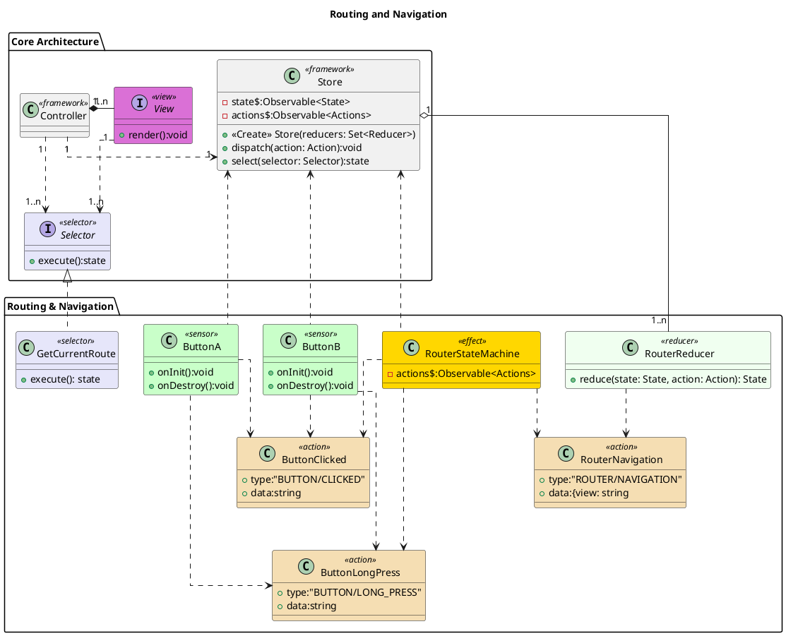

# Routing & Navigation

Routing and navigation are how the user moves through the application. The primary modes of movement are through the use of buttons (named A and B). Two different presses can be used, a standard click and release, and a long press. These clicks are interpreted by the RouterStateMachine effect and converted into RouterNavigation messages where appropriate. Not all clicks will result in navigation. In this case, we chose to model it as an effect, but it would also be possible to use a reducer. An effect gives us the ability to call async actions during the navigation phase, giving us more flexibility in the final solution.

The Controller listens to the Store for changes. It then uses the GetCurrentRoute selector to query the Store for the piece of the state it cares about. If the value has changed, then it loads the appropriate View class and calls render. If not, it does nothing.

This pattern follows similar mechanics used in web development in the NGRX libraries modified for the current context. It ignores many of the lifecycle hooks that are needed to handle permissions and auth in web applications.  [1]

# Bibliography
[1]NGRX Team, ‘NgRx - @ngrx/router-store’, NGRX Documentation: @ngrx/router-store. https://ngrx.io/guide/router-store (accessed Dec. 07, 2020).

# PlantUML

