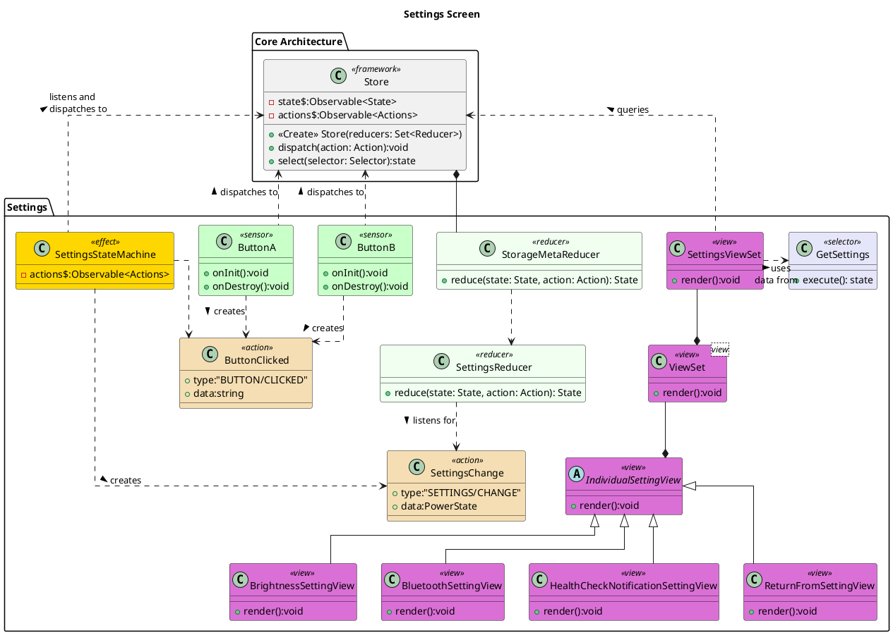

![](http://www.plantuml.com/plantuml/png/jLLTRoet47tthnYXIYMtXVk-sg8BcvIW9gGAj7re--2iPrcBnQRsB1Ib-U_rVX2SPGbAelW9ZS-S6PyvEtopn0tbgupPfLHhRlWARCg5tagrW8Hd5hsRJ2gatHf16qgrTn5dt5fuPE3EYCVBXT6v4f7Ej0b3WoAFqGm6SAqLxYvnsuxZCKcj7EoF53crOomggmkgESQfSh75hXsuaRXri3iJfrAqGp19C2O76kjCd2gNEKXPy8PlK0aqx8anafGXp938gMHX5Xj4nTZtFnqE24oaaiMBB5ixNhv0w4JQ80oBdiZnvWOxjMYLW9qPwI8MXebJ5RVQB5rbXwZF3s4O6UI4Bbf2kxMsDYYw2UzhfI-UCtgM7FoxuEx1ejdmXmp36HK41qGbkts16LQnmQ6oa7RDAKwx5Jo02d8HRBGK1rWbM7Ulcskh_dKHb9sKo2UduK6JlOmlfHZbH5eDmHkvfuDM4oMfswokrILQCdhdtxXQJThHvz16cOoNAC2piaTUV3X1P_JRV7ut_HhTJA9VhYuxdi2SkDF8E2cE-VSQHIbN2tormEngFfzCnxElqVLmEhvgLlXLRz6K5ZXTfRo-vSwb2i7xJXxVO1f7x3EJDdo1jqYyzYXuUy5_H1NibcO9eEpaHsXw3iuyu3DhZ97sPS1V41u__ejnJjXr9FRrHd-Nk7M_eTvNZIwBTNFISdLgbVWs0lvWoV2OQgQ94d8ZHSwpkgs2-ZqjZOnSfAJGseyIPJcIrfH-aESQUKPfb6Ayd6gIYOnvCTmFijuZvKRzRFJgFKJW3dDy-mNNxmyQwoE00SJbchSrQdG6nPh6T_3cpYZmcRI4oaAY3MDD3_QDI_BTNMJa5YtyfOhL0ObxyN5QJ_I-xCt8deCkrcehrh89-iBhjWuoTiAL__LwxJvxDS7tqtdy6T-SoMxt1sEjs_LehksmjddwyozbHGZxVMZD3vv7pvLmyzp_cwC5qX3MwLzSyyVpyRYRimyWX7zoD1AjXwgTNTw-A7I46RLWJWZL-pELGg3wsxJs-0sLo5VP_m00)

# Settings Screen 

Each of the settings is handled as a seperate view. This can make rendering more effecient as we can render only the parts that have changed instead of all views.

The StorageMetaReducer wraps any reducer and persists its state. It can also take care of loading an initial state. This might be worth moving into the core. This is a good example of the composibility of reducers. 

# Bibliography

# PlantUML

