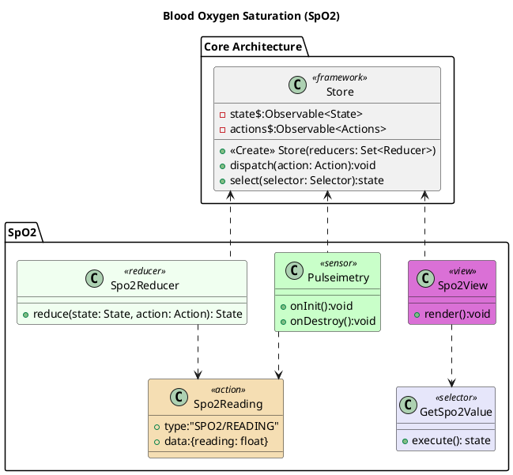

# Blood Oxygen Saturation (SpO2)
Peripheral capillary oxygen saturation or as its more commonly known SpO2 is the percentage of oxygenated haemoglobin (the protein that carries oxygen in the blood) versus the the total amount of haemoglobin in the blood. The pulse oximeter (the sensor to measure Sp02) transmits multiple light wavelenghts, some of these will be absorbed based on the users blood oxygen levels, our sensor reads these leftover light waves. A value under 90% indicates hypoxia.

There are limitations to this method. If a user is too cold their vessels may be restricted. Obesity, low blood pressure and low sampling rates of the device can also cause issues with readings.

There may be a possibility to add more derived readings. [1] The pulse oximeter can be used as a more general photoplethysmogram (PPG) device. When used as such we can read:
- heart rate and cardiac cycle.
- respiration. 
- bood pressure.
- hypo- and hypervolemia, which may be an early warning sign for congestive heart failure, kidney failure, and liver failure.

# Bibliography
[1]Liverpool Hospital ICU, ‘LiverpoolSpO2 Monitoring | Hemoglobin | Physiology’, Scribd. https://www.scribd.com/document/399193213/LiverpoolSpO2-Monitoring (accessed Dec. 11, 2020).

# PlantUML

