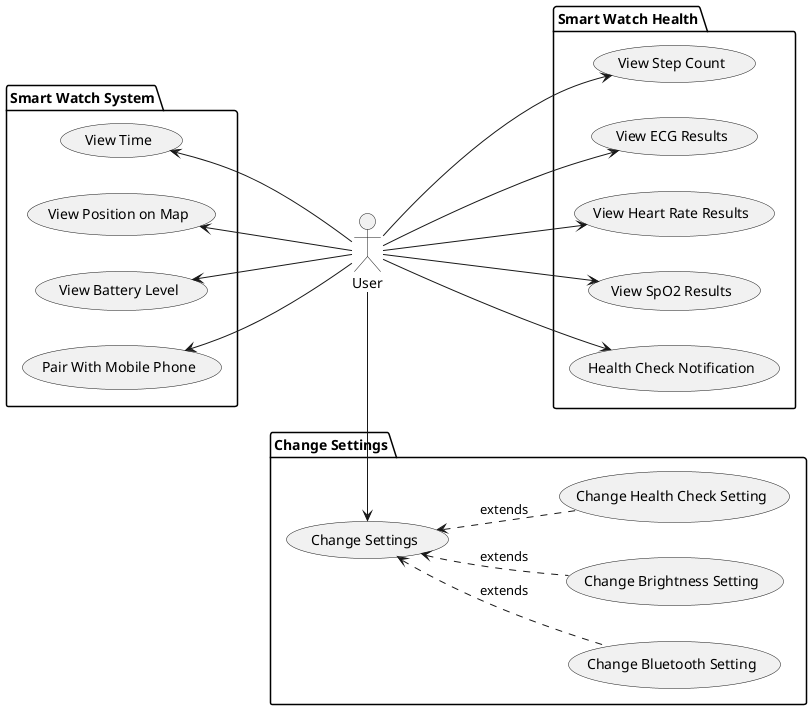

# Use Case Diagram

# PlantUML

```plantuml
@startuml

left to right direction
skinparam shadowing false

actor User

package "Smart Watch Health" as health {
    usecase "View Step Count" as UC0
    usecase "View ECG Results" as UC1
    usecase "View Heart Rate Results" as UC2
    usecase "View SpO2 Results" as UC3
    usecase "Health Check Notification" as UC9
}

package "Smart Watch System" as system {
    usecase "View Time" as UC4
    usecase "View Position on Map" as UC5
    usecase "View Battery Level" as UC6
    usecase "Pair With Mobile Phone" as UC7
}

package "Change Settings" as settings {
    usecase "Change Settings" as UC8
    usecase "Change Bluetooth Setting" as UC10
    usecase "Change Brightness Setting" as UC11
    usecase "Change Health Check Setting" as UC12
}

User --> UC0
User --> UC1
User --> UC2
User --> UC3
User --> UC9

UC4 <-- User
UC5 <-- User
UC6 <-- User
UC7 <-- User

UC8 <- User
UC8 <.. UC10 : extends
UC8 <.. UC11 : extends
UC8 <.. UC12 : extends

@enduml
```
