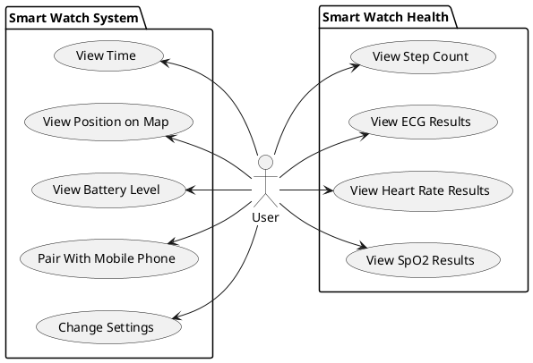

# Use Case Diagram

# PlantUML

```plantuml
@startuml

left to right direction

actor User

package "Smart Watch Health" as health {
    usecase "View Step Count" as UC0
    usecase "View ECG Results" as UC1
    usecase "View Heart Rate Results" as UC2
    usecase "View SpO2 Results" as UC3
}

package "Smart Watch System" as system {
    usecase "View Time" as UC4
    usecase "View Position on Map" as UC5
    usecase "View Battery Level" as UC6
    usecase "Pair With Mobile Phone" as UC7
    usecase "Change Settings" as UC8
}

User--> UC0
User--> UC1
User--> UC2
User--> UC3

UC4 <-- User
UC5 <-- User
UC6 <-- User
UC7 <-- User
UC8 <-- User

@enduml
```
